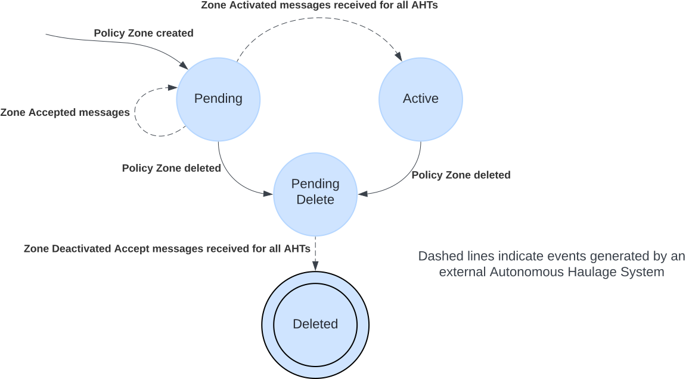

# Policy Zones
Policy Zones are geographically bounded regions within a map in which Autonomous Vehicle (AV) are required to modify their behaviour to comply with one or more policies associated with that zone. Examples of policies include: Exclusions, where AVs are forbidden to enter or driving within the zone; speed limits, in which AVs are required to regulate their speeds to comply with specified limits; and controlled access, where AVs may only enter if explicitly instructed to move into the zone.

### Language
| Acronyms | Extended Name |
| --- | --- |
| AHS | Autonomous Haulage System |
| AV | Autonomous Vehicle|
| FMS | Fleet Management System |

## Policy Zones Specification
This repository defines the messages and protocols used for managing policy zones in AV, where policy zones are described using the GeoJSON [RFC7946](https://datatracker.ietf.org/doc/html/rfc7946) geospatial data interchange format. Policies can be associated with these zones via the `properties` field of the GeoJSON object, allowing for flexible and extensible definitions of how AV should behave within these zones.

> [!IMPORTANT]
> Policy Zones also leverages the FleetDefinitionV2 message from ISO 23725, which is a standard for the exchange of fleet definition information between AHS and FMS.

The following policies are defined in this specification:
- [Exclusion](./specification/V1/policies.md#exclusion)
- [Speed Limit](./specification/V1/policies.md#speed-limit)
- [Low Traction](./specification/V1/policies.md#low-traction)
- [Rough Road](./specification/V1/policies.md#rough-road)
- [Controlled Access](./specification/V1/policies.md#controlled-access) 

> [!NOTE]
> This list is not exhaustive and more policies can be added in the future.

For more information on the messages used in the V1 protocol for managing policy zones, see the [V1 Specification](specification/V1/README.md).

## Policy Zone State Machine

Policy zones have a lifecycle that is managed by the FMS. This lifecycle includes the following states:
- `Pending`: The policy zone has been created but has not yet been activated.
- `Active`: The policy zone is currently active and is being enforced.
- `Pending Delete`: The policy zone has been marked for deletion but has not yet been removed.
- `Deleted`: The policy zone has been removed and is no longer active.

The following state machine describes the lifecycle of a policy zone as it transitions between these states:

> [!NOTE]
> Policy zones that are rejected are still considered pending and can be re-sent to the truck for activation at a later time.

> [!IMPORTANT]
> Policy zones contain a number of fields that are immutable. These include:
> - the geometry of the zone.
> - the set of policies (and their respective attributes) associated with zone.
>
> Edits made by end-users to these attributes must be managed through the following process:
> - Create a new policy zone reflecting the desired new state of the policy zone,
> - Delete the previous version of the policy zone.
>
> This is intended to remove any ambiguity about the state of the policy zone.

## Sequence diagrams

See [Sequence Diagrams](diagram/SequenceDiagrams.md) for a detailed set of scenarios that describe the interactions between the FMS, AHS, and AV when managing policy zones.

## Communication Protocols

This specification does not indicate the use of any specific communication protocol between the FMS and AHS. Providing the protocols can meet the requirements, integrators can choose to support for one or more protocols such as HTTP, WebSockets, or MQTT

All communications protocols selected must be implemented to meet the following requirements:
 - Connections are monitored from both sides
 - Communications are managed asynchronously