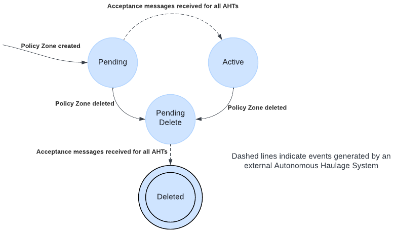

# Policy Zones
Policy Zones is the collection of all defined zones of the mine that in some how are restricted for one or more vehicles. 

## Types of zones: 
- Exclusion (Truck MUST not enter)
- SpeedLimit (Truck MUST reduce speed)
- Road Conditions (Low Traction or Rough Road)

## Policy Zone State Machine

Policy zones have a lifecycle that is managed by the FMS. This lifecycle includes the following states:
- `Pending`: The policy zone has been created but has not yet been activated.
- `Active`: The policy zone is currently active and is being enforced.
- `Pending Delete`: The policy zone has been marked for deletion but has not yet been removed.
- `Deleted`: The policy zone has been removed and is no longer active.

The following state machine describes the lifecycle of a policy zone as it transitions between these states:



**Note**: Zones that are rejected are still considered pending and can be re-sent to the truck for activation at a later time.

## Sequence diagram
### Activate Policy Zone


## General connection rules
- All requests are done from FMS to AHS through HTTP and is done individal per autonomous vehicle. 
- HTTP responses are only covering that message as such is accepted, i.e the AHS service is up
- Responses regarding the content of the request is send through Websocket 

## Common Structure
Each Policy Zone follows this basic structure
```json
{
  "geometry": {
    "coordinates": ...,
    "type": "Polygon"
  },
  "properties": {
    "id": "uuid",
    "name": "Zone Name",
    "policies": {
      // Policy objects go here
    }
  },
  "type": "Feature"
}
```

## Exclusion Zone
An exclusion policy indicates that vehicles MUST not enter the zone while it exists.

The behaviour of vehicles already inside the zone is controlled by the `vacateBy` property where:

  *  Vehicles already inside the zone will operate as per normal until the `vacateBy` time has been reached

 * Once the timeout has elapsed, all operations must cease immediately

 * A `vacateBy` property matching the time the zone was created indicates that vehicles should cease all operations as soon as the zone is created

 * Vehicles that leave the zone prior to the `vacateBy` time may continue normal operations outside the zone

### Example 
```json
{
  "geometry": {
    "coordinates": ...,
    "type": "Polygon"
  },
  "properties": {
    "id": "3d3d1bcf-5562-46eb-87a0-cdef15669f9d",
    "name": "Exclusion Area",
    "policies": {
      "Exclusion": {
        "vacateBy": "2024-04-04T06:05:47Z"
      }
    }
  },
  "type": "Feature"
}
```

## Speed Limit Zone
A speed limit policy indicates that vehicles MUST reduce speed to the indicated limit while inside the zone while it is active.
The speed limit can be defined either as an absolute value in m/s or as a percentage of the typical operating speed of the vehicle in that location.
NOTE: When multiple overlapping speed zones exist, the lowest speed limit applies.

### Example 
```json
{
  "geometry": {
    "coordinates": ...,
    "type": "Polygon"
  },
  "properties": {
    "id": "3d3d1bcf-5562-46eb-87a0-cdef15669f9d",
    "name": "Speed Limited Area",
    "policies": {
      "speedLimit": {
        "type": "absolute",
        "value": 5.555
      }
    }
  },
  "type": "Feature"
}
```

## Road Conditions
Road condition policies indicate that vehicles MUST adjust their driving behavior while inside the zone based on specified conditions. Two types of conditions are supported:
- Low Traction: Indicates reduced road grip
- Rough Road: Indicates poor road surface conditions

Each condition is represented as a separate policy. The presence of a condition policy indicates that the condition applies to the zone.

```json
{
  "geometry": {
    "coordinates": ...,
    "type": "Polygon"
  },
  "properties": {
    "id": "3d3d1bcf-5562-46eb-87a0-cdef15669f9d",
    "name": "Muddy Access Road",
    "policies": {
      "lowTraction": {},
      "roughRoad": {}
    }
  },
  "type": "Feature"
}
```
---

## Activate Policy zone
* `POST`            `/v1/equipment/e6d895b0-e377-4567-8b1a-8d2a4f3104ff/zones`
```json
{
    "Protocol": "Open-Autonomy",
    "Timestamp": "2024-08-23T07:20:33.665Z",
    "Zone": {
        "type": "Feature",
        "geometry": {
            "type": "Polygon",
            "coordinates": [
              [
                [
                    59.154612700275194,
                    17.62123606784992,
                    0
                ],
                [
                    59.15444657134832,
                    17.621361182777765,
                    0
                ],
                [
                    59.154458381940245,
                    17.62176503107635,
                    0
                ],
                [
                    59.154774479447724,
                    17.621645401146836,
                    0
                ],
                [
                    59.154612700275194,
                    17.62123606784992,
                    0
                ]
              ]
            ]
        },
        "properties": {
            "id": "00000000-0000-0000-0000-000000000001",
            "policyType": "Exclusion",
            "name": "grading 1",
            "vacateBy": "2024-08-23T08:20:33.6652639Z"
        }
    }
}
```

* AHS response: `HTTP/1.1 202 Accepted`

* The truck acceps the zone and AHS responds over Websocket
```json
{
    "Protocol": "Open-Autonomy",
    "CorrelationId": "71b0ac40-5b73-4444-ac37-dbf7e51e8186",
    "Timestamp": "2024-08-23T07:20:35.344Z",
    "ActivateZoneResponseV1": {
        "EquipmentId": "e6d895b0-e377-4567-8b1a-8d2a4f3104ff",
        "ZoneId": "00000000-0000-0000-0000-000000000001",
        "Status": "Accepted"
    }
}
```
---
## Update existing hazard zone
Policy zones contain a number of fields that are immutable. These include:
- the geometry of the zone.
- the set of policies (and their respective attribtues) associated with zone.

Edits made by end-users to these attributes must be managed through the following process:
- Create a new policy zone reflecting the desired new state of the policy zone,
- Delete the previous version of the policy zone.

This is intended to remove any ambiguity about the state of the policy zone.

---
# Publish all zones 
* `POST`            `/v1/equipment/e6d895b0-e377-4567-8b1a-8d2a4f3104ff/zones/all`

```json
{
  "Protocol": "Open-Autonomy",
  "Timestamp": "2024-08-23T08:19:56.631Z",
  "Zones": [
    {
      "type": "Feature",
      "geometry": {
        "type": "Polygon",
        "coordinates": [
         [
          [
            59.154612700275194,
            17.62123606784992
          ],
          [
            59.15444657134832,
            17.621361182777765
          ],
          [
            59.154458381940245,
            17.62176503107635
          ],
          [
            59.154774479447724,
            17.621645401146836
          ],
          [
            59.154612700275194,
            17.62123606784992
          ]
         ]
        ]
      },
      "properties": {
        "id": "00000000-0000-0000-0000-000000000001",
        "policyType": "Exclusion",
        "name": "grading 1",
        "vacateBy": "2024-08-23T08:20:33.6652639Z"
      }
    },
    {
      "type": "Feature",
      "geometry": {
        "type": "Polygon",
        "coordinates": [
         [
          [
            59.154244958079,
            17.620554410746
          ],
          [
            59.154391048629,
            17.620733999199
          ],
          [
            59.154275508018,
            17.621266018812
          ],
          [
            59.154121113519,
            17.621085793262
          ],
          [
            59.154244958079,
            17.620554410746
          ]
         ]
        ]
      },
      "properties": {
        "id": "00000000-0000-0000-0000-000000000002",
        "policyType": "Exclusion",
        "name": "grading 2",
        "vacateBy": "2024-08-23T08:20:33.6652639Z"
      }
    },
    {
      "type": "Feature",
      "geometry": {
        "type": "Polygon",
        "coordinates": [
         [
          [
            59.154998915988,
            17.621767651459
          ],
          [
            59.154835229909,
            17.621800464999
          ],
          [
            59.154847165895,
            17.622115535915
          ],
          [
            59.155000821112,
            17.622085194746
          ],
          [
            59.15499725505,
            17.621767524328
          ],
          [
            59.154998915988,
            17.621767651459
          ]
         ]
        ]
      },
      "properties": {
        "id": "00000000-0000-0000-0000-000000000003",
        "policyType": "Exclusion",
        "name": "grading on-road",
        "vacateBy": "2024-08-23T08:20:33.6652639Z"
      }
    }
  ]
}
```

* AHS response: `HTTP/1.1 202 Accepted`

* The truck accepts the zone and AHS responds over Websocket
```json
{
    "Protocol": "Open-Autonomy",
    "CorrelationId": "34b53af5-cc4a-4e4f-a5e2-19fa0357ec5f",
    "Timestamp": "2024-08-23T09:13:43.815Z",
    "ActivateAllZonesResponseV1": {
        "EquipmentId": "e3239fd8-a625-4ef5-89b1-ef26bb13f2db",
        "Status": "Accepted",
        "ActivatedZones": [
            {
                "ZoneId": "00000000-0000-0000-0000-000000000001"
            },
            {
                "ZoneId": "00000000-0000-0000-0000-000000000002"
            },
            {
                "ZoneId": "00000000-0000-0000-0000-000000000003"
            }
        ]
    }
}
```

---

# Truck is offline
It is always the responsibility of the AHS to determine whether a policy zone is safe to activate, as it is expected that trucks will go offline from time to time. In the event that a truck is offline when a policy zone change is requested, the AHS may choose to:

 - reject the policy zone change request until the truck has re-established connection.
 - accept the policy zone change request if and only if the truck can be guaranteed to have come to a stop and is no longer in motion.

## Scenarios

### Expected Offline Scenario

In the event that the truck has been parked up and powered off, the AHS may choose to accept the policy zone change request on behalf of the truck.

The following message provides an example of a policy zone change request that is accepted after the truck has been powered off.

```json
{
    "Protocol": "Open-Autonomy",
    "CorrelationId": "7850cb0e-dee0-4b21-8948-73dec03f3887",
    "Timestamp": "2024-08-23T07:26:33.344Z",
    "ActivateZoneResponseV1": {
        "EquipmentId": "e6d895b0-e377-4567-8b1a-8d2a4f3104ff",
        "ZoneId": "00000000-0000-0000-0000-000000000001",
        "Status": "Accepted"
    }
}
```

* When the truck comes back online the truck shall send OutOfSync to the FMS

```json
{
    "Protocol": "Open-Autonomy",
    "CorrelationId": "7850cb0e-dee0-4b21-8948-73dec03f3887",
    "Timestamp": "2024-08-23T08:19:55.621Z",
    "OutOfSyncV1": {
        "EquipmentId": "e6d895b0-e377-4567-8b1a-8d2a4f3104ff"
    }
}
```

* The FMS should then publish all active zones to the truck using [Publish All Zones](#publish-all-zones), which will include the zones that were accepted after the truck was powered off.

### Loss of Comms Scenario 1 - Truck cannot be guaranteed to have come to a stop

In the event that a truck has lost connection to the AHS, the AHS may choose to reject the policy zone change request until the truck has re-established connection.

The following message provides an example of a policy zone change request that is rejected due to the truck being unexpectedly offline.

```json
{
    "Protocol": "Open-Autonomy",
    "CorrelationId": "7850cb0e-dee0-4b21-8948-73dec03f3887",
    "Timestamp": "2024-08-23T07:26:33.344Z",
    "ActivateZoneResponseV1": {
        "EquipmentId": "e6d895b0-e377-4567-8b1a-8d2a4f3104ff",
        "ZoneId": "00000000-0000-0000-0000-000000000001",
        "Status": "Rejected",
        "Reason": "UnexpectedOffline"
    }
}
```

In such an event, the FMS may attempt to continue sending the policy zone change request until the truck has re-established connection.

* When the truck comes back online, the truck shall send OutOfSync to the FMS

```json
{
    "Protocol": "Open-Autonomy",
    "CorrelationId": "7850cb0e-dee0-4b21-8948-73dec03f3887",
    "Timestamp": "2024-08-23T08:19:55.621Z",
    "OutOfSyncV1": {
        "EquipmentId": "e6d895b0-e377-4567-8b1a-8d2a4f3104ff"
    }
}
```
* The FMS should then publish all active zones to the truck using [Publish All Zones](#publish-all-zones), then
* Resend any policy zones that are still pending (including the zones that were rejected due to being unexpectedly offline).

### Loss of Comms Scenario 2 - Truck comes to stop after comms loss timeout

In the event that a truck has lost connection to the AHS, the AHS may choose to accept the policy zone change request after the truck can be guaranteed to have come to a stop due to the comms loss timeout.

The following message provides an example of a policy zone change request that is accepted after the truck has come to a stop.

```json
{
    "Protocol": "Open-Autonomy",
    "CorrelationId": "7850cb0e-dee0-4b21-8948-73dec03f3887",
    "Timestamp": "2024-08-23T07:26:33.344Z",
    "ActivateZoneResponseV1": {
        "EquipmentId": "e6d895b0-e377-4567-8b1a-8d2a4f3104ff",
        "ZoneId": "00000000-0000-0000-0000-000000000001",
        "Status": "Accepted"
    }
}
```

* When the truck comes back online the truck shall send OutOfSync to the FMS

```json
{
    "Protocol": "Open-Autonomy",
    "CorrelationId": "7850cb0e-dee0-4b21-8948-73dec03f3887",
    "Timestamp": "2024-08-23T08:19:55.621Z",
    "OutOfSyncV1": {
        "EquipmentId": "e6d895b0-e377-4567-8b1a-8d2a4f3104ff"
    }
}
```

* The FMS should then publish all active zones to the truck using [Publish All Zones](#publish-all-zones), which will include the zones that were accepted after the truck came to a stop.


