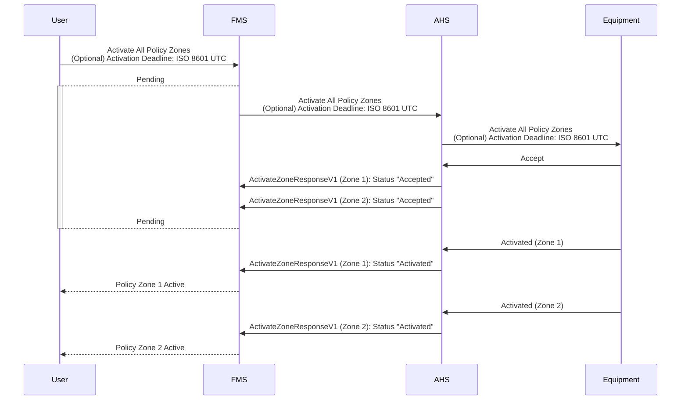
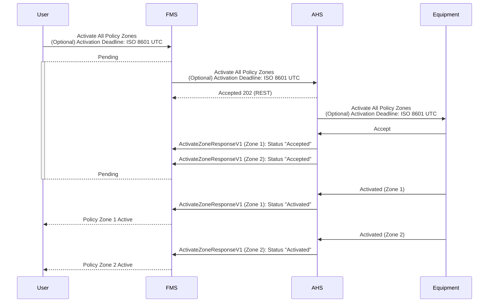

# Sequence Diagram - All Policy Zones Activation

## Message Sequence

```mermaid
sequenceDiagram
    participant User
    participant FMS
    participant AHS
    participant Equipment

    User->>FMS: Activate All Policy Zones <br/> (Optional) Activation Deadline: ISO 8601 UTC
    FMS-->+User: Pending
    FMS->>AHS: Activate All Policy Zones <br/> (Optional) Activation Deadline: ISO 8601 UTC
    AHS->>Equipment: Activate All Policy Zones <br/> (Optional) Activation Deadline: ISO 8601 UTC
    Equipment->>AHS: Accept

    AHS->>FMS: ActivateZoneResponseV1 (Zone 1): Status "Accepted"
    AHS->>FMS: ActivateZoneResponseV1 (Zone 2): Status "Accepted"
    User-->-FMS: Pending


    Equipment->>AHS: Activated (Zone 1)
    AHS->>FMS: ActivateZoneResponseV1 (Zone 1): Status "Activated"
    FMS-->>User: Policy Zone 1 Active

    Equipment->>AHS: Activated (Zone 2)
    AHS->>FMS: ActivateZoneResponseV1 (Zone 2): Status "Activated"
    FMS-->>User: Policy Zone 2 Active
```

## FMS to AHS REST Implementation
(I don't even think we need this...)

```mermaid
sequenceDiagram
    participant User
    participant FMS
    participant AHS
    participant Equipment

    User->>FMS: Activate All Policy Zones <br/> (Optional) Activation Deadline: ISO 8601 UTC
    FMS-->+User: Pending
    FMS->>AHS: Activate All Policy Zones <br/> (Optional) Activation Deadline: ISO 8601 UTC
    AHS-->>FMS: Accepted 202 (REST)
    AHS->>Equipment: Activate All Policy Zones <br/> (Optional) Activation Deadline: ISO 8601 UTC
    Equipment->>AHS: Accept

    AHS->>FMS: ActivateZoneResponseV1 (Zone 1): Status "Accepted"
    AHS->>FMS: ActivateZoneResponseV1 (Zone 2): Status "Accepted"
    User-->-FMS: Pending


    Equipment->>AHS: Activated (Zone 1)
    AHS->>FMS: ActivateZoneResponseV1 (Zone 1): Status "Activated"
    FMS-->>User: Policy Zone 1 Active

    Equipment->>AHS: Activated (Zone 2)
    AHS->>FMS: ActivateZoneResponseV1 (Zone 2): Status "Activated"
    FMS-->>User: Policy Zone 2 Active
```
