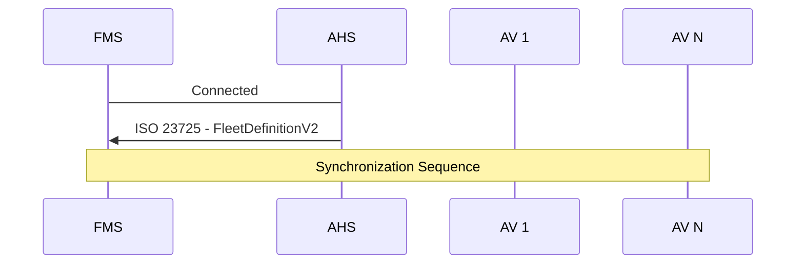
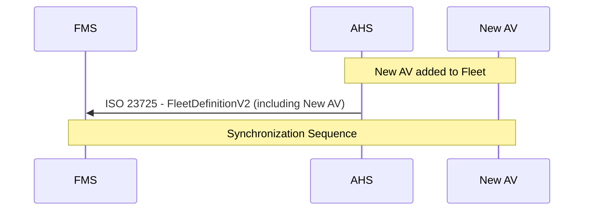
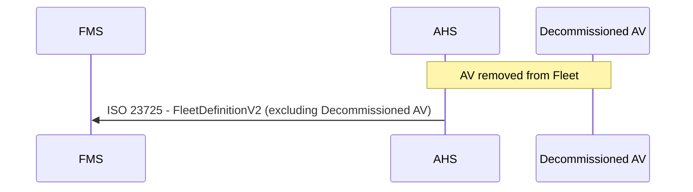

# Fleet Synchronization

This document describes the fleet synchronization process between the Autonomous Haulage System (AHS) and the Fleet Management System (FMS) using the ISO 23725 `FleetDefinitionV2` message. This message is used to inform the FMS of the set of Autonomous Vehicles (AVs) managed by the AHS, allowing the FMS to correctly manage policy zone synchronization with the AVs in the fleet.

## On Connect
The Autonomous Haulage System (AHS) will send an ISO 23725 `FleetDefinitionV2` message to the Fleet Management System (FMS) of the Autonomous Vehicles(AV) in the fleet when the connection is established.

## Vehicle Commissioning
When a new AV is commissioned into the fleet, the AHS will send an updated `FleetDefinitionV2` message to the FMS to include the new AV.

## Vehicle Decommissioning
When an AV is decommissioned from the fleet, the AHS will send an updated `FleetDefinitionV2` message to the FMS to remove the decommissioned AV.

