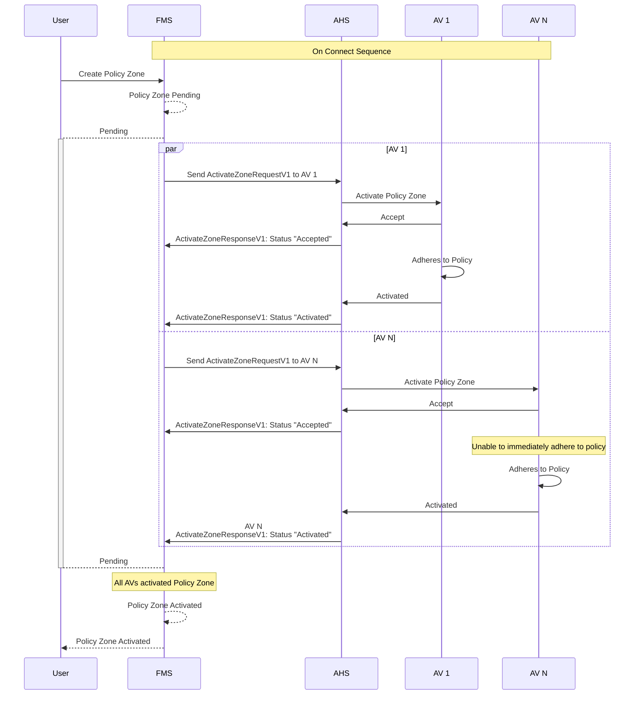

# Policy Zone Activation
When a policy zone is created, the Fleet Management System (FMS) initiates the activation process by sending `ActivateZoneRequestV1` messages to the Autonomous Haulage System (AHS) for each of the Autonomous Vehicle (AV)s defined in the Fleet Definition. The AHS then communicates with each of the AVs to activate the policy zone internally. The following sequence diagram illustrates this process.

> [!IMPORTANT]
> All systems shall implement idempotency when managing Policy Zone Activations.

## Typical Policy Zone Activation

## Policy Zone Activation Deadline Exceed
The policy zone can be created with the `activationDealine` property. This field is an indicative field that lets the AV know it should start to adhere to the policy if possible. However, it is not a strict demand and the AV is allowed to defer compliance up until the specified time.

> [!NOTE]
> The inclusion of the activation deadline does not change the activation process from the perspective of the FMS. For FMS to consider the zone active in the FMS, the FMS still requires confirmation from all AVs that the zone has been activated.

## Policy Zone Activate Rejection
When an AV cannot adhere to the policy defined in the policy zone definition, the AHS should send a `"Rejected"` status in the `ActiveZoneResponse` message to FMS. The FMS will then notify the user accordingly.

> [!NOTE]
> If an AV rejects the `ActivateZoneRequestV1` message for a given zone, the zone will not be activated within the FMS and will remain as `"pending"` until all AVs have successfully activated the zone.

