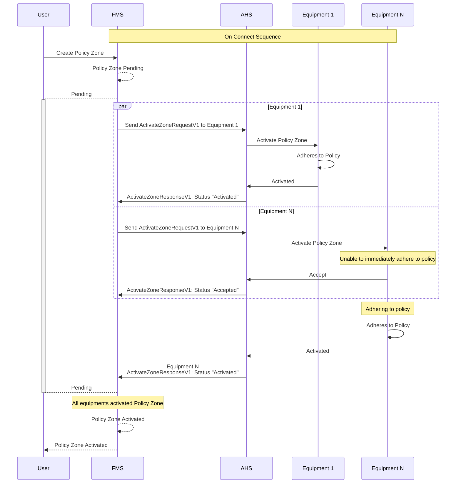
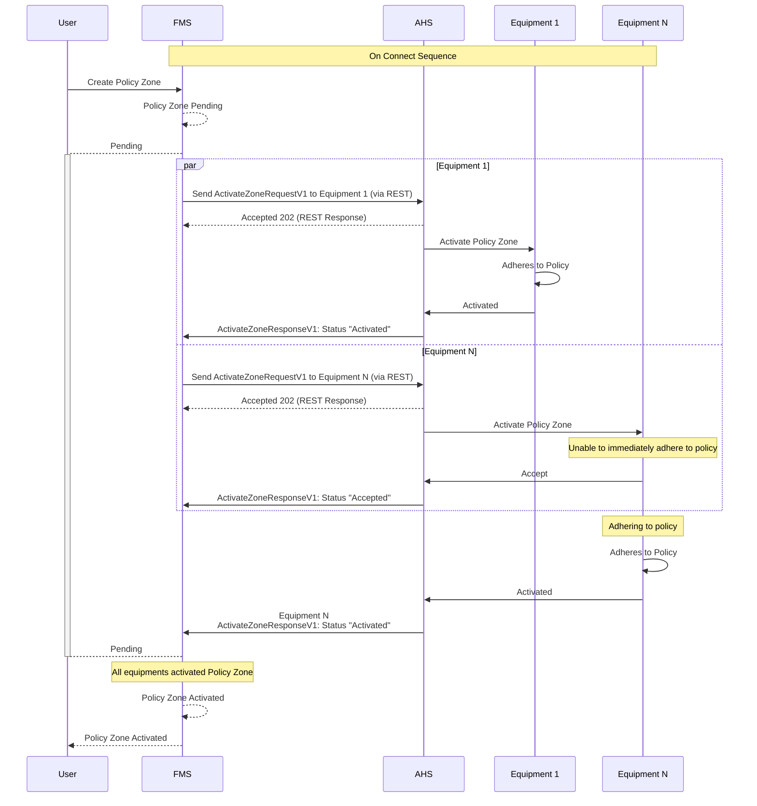

## Policy Zone Activation
When a policy zone is created, the Fleet Management System (FMS) initiates the activation process by sending `ActivateZoneRequestV1` messages to the Autonomous Haulage System (AHS) for each of the equipment pieces involved. The AHS then communicates with each of the equipments to activate the policy zone internally. The following sequence diagram illustrates this process.

### Implementation with REST from FMS to AHS
The following sequence diagram illustrates the implementation of the policy zone activation using REST calls from the FMS to the AHS system, which then communicates with the equipment.

>[!NOTE]
>The REST implementation above ensures that the FMS can handle asynchronous responses from the AHS, allowing for a more robust and scalable system. The AHS responds with a 202 Accepted status to indicate that the request has been received and is being processed, and **MUST** not be used as the final activation status. The final activation status is communicated through the `ActivateZoneResponseV1` message.