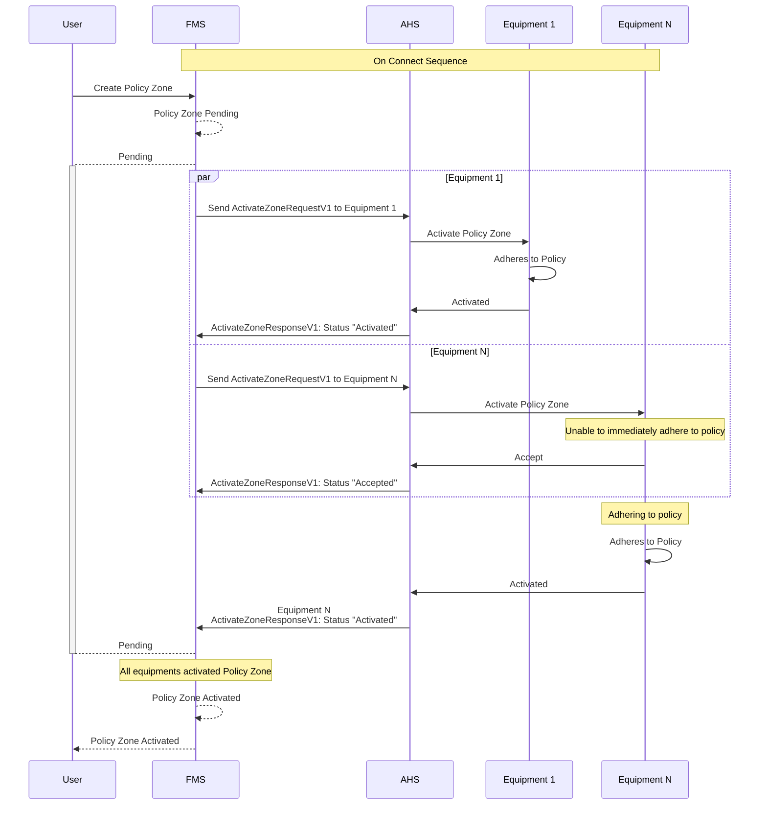
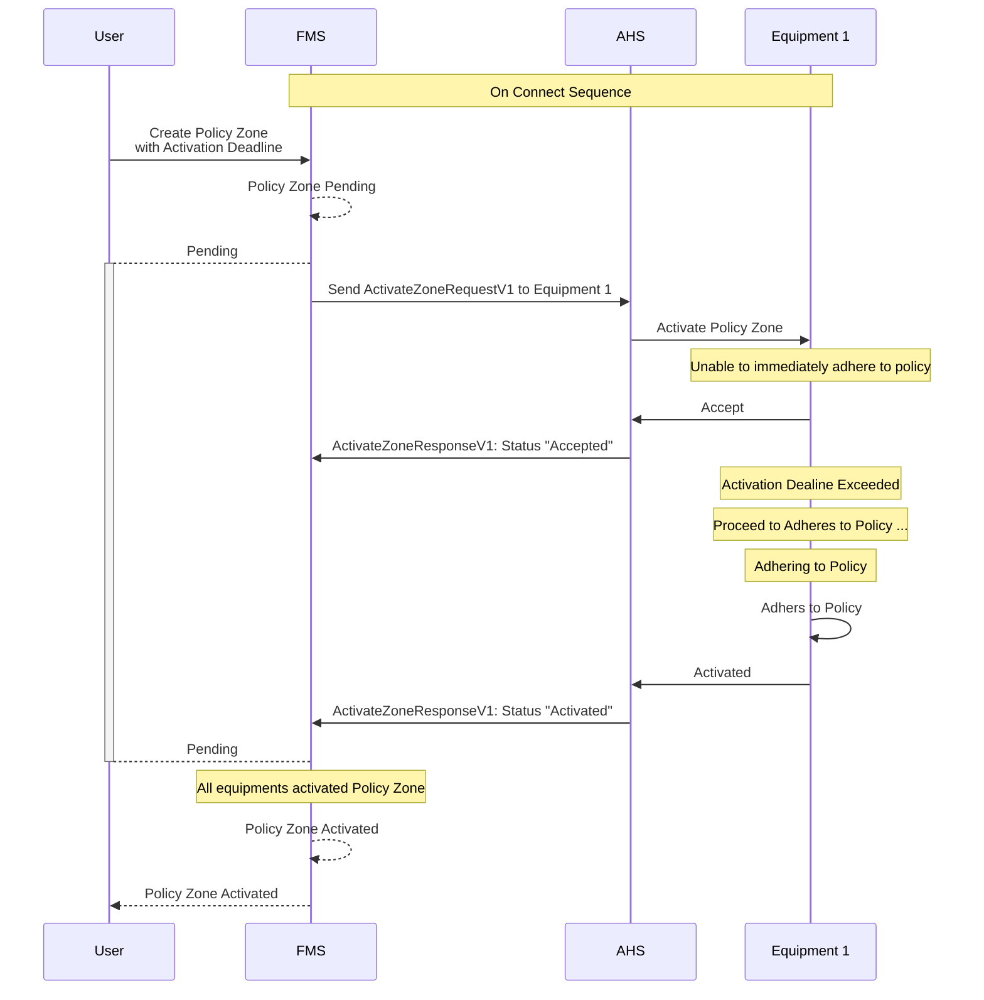
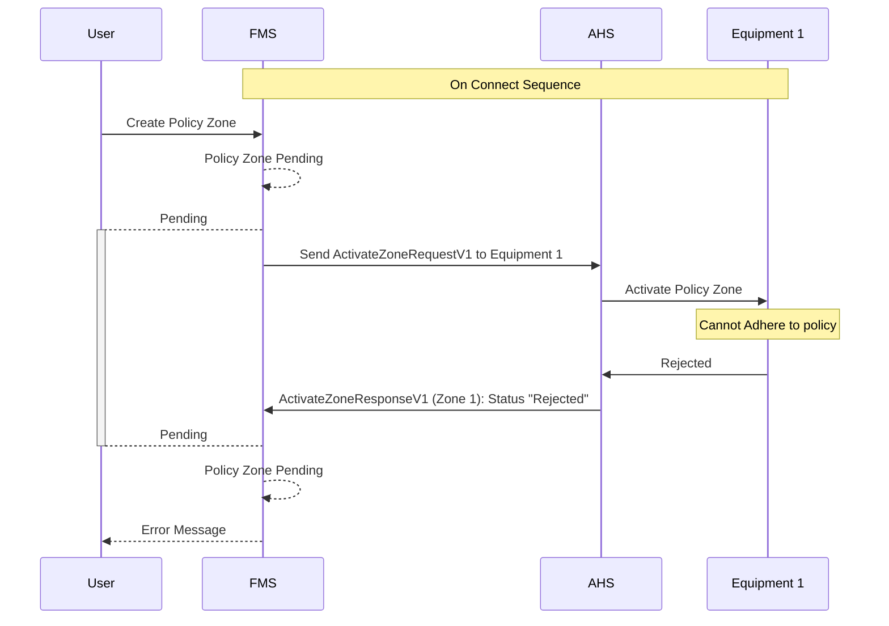
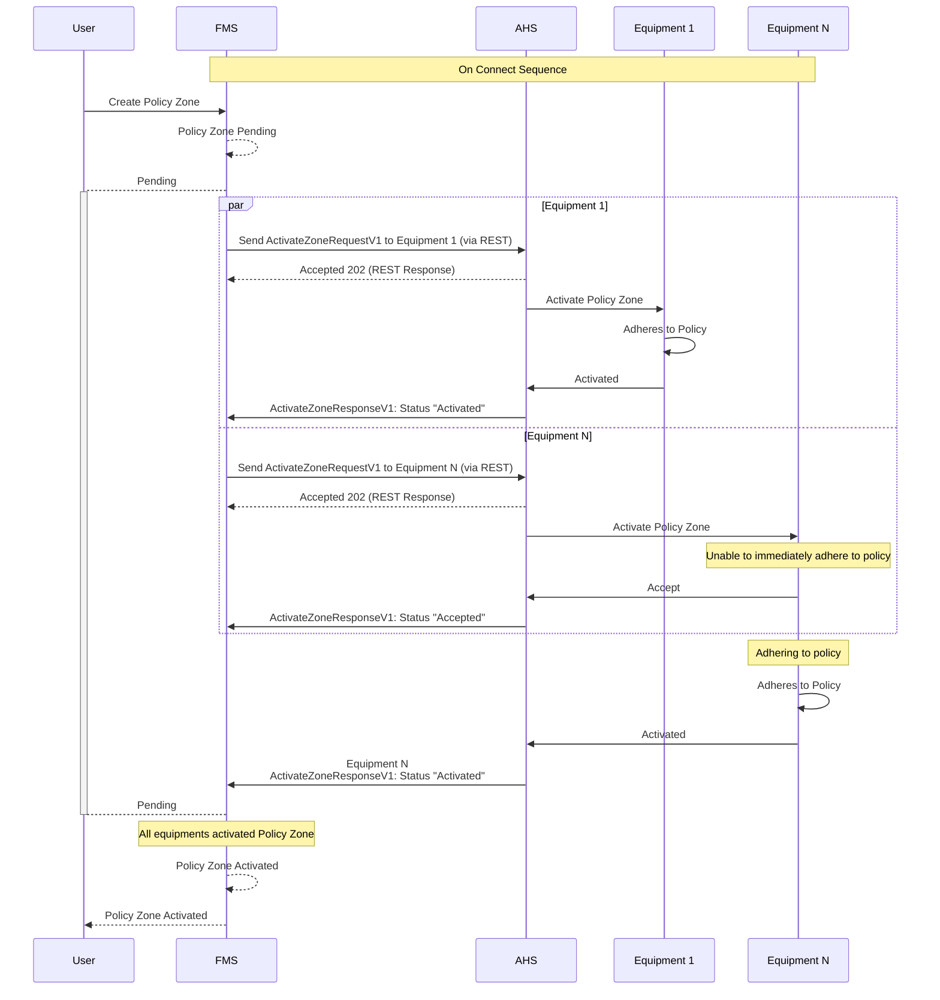

# Policy Zone Activation
When a policy zone is created, the Fleet Management System (FMS) initiates the activation process by sending `ActivateZoneRequestV1` messages to the Autonomous Haulage System (AHS) for each of the equipment pieces involved. The AHS then communicates with each of the equipments to activate the policy zone internally. The following sequence diagram illustrates this process.

## Typical Policy Zone Activation

## Policy Zone Activation Deadline Exceed
The policy zone can be created with a `activationDealine` property. This field is an indicative field that lets the equipment know it should start to adhere to the policy if possible. However, it is not a strict demand that the equipment must comply by the specified time.

## Policy Zone Activate Rejection
When a equipment cannot adhere to the policy defined in the policy zone definition, AHS should send a `"Rejected"` status in the `ActiveZoneResponse` message to FM. The FMS will then notify the user accordingly.

> [!NOTE]
> If any vehicle rejects the `ActivateZoneRequestV1` message on the same zone, the zone will not be activated within the FMS and will be marked as `"pending"` until the user resolves the issue.

## Implementation with REST from FMS to AHS
The following sequence diagram illustrates the implementation of the policy zone activation using REST calls from the FMS to the AHS system, which then communicates with the equipment.

>[!NOTE]
>The REST implementation above ensures that the FMS can handle asynchronous responses from the AHS, allowing for a more robust and scalable system. The AHS responds with a 202 Accepted status to indicate that the request has been received and is being processed, and **MUST** not be used as the final activation status. The final activation status is communicated through the `ActivateZoneResponseV1` message.