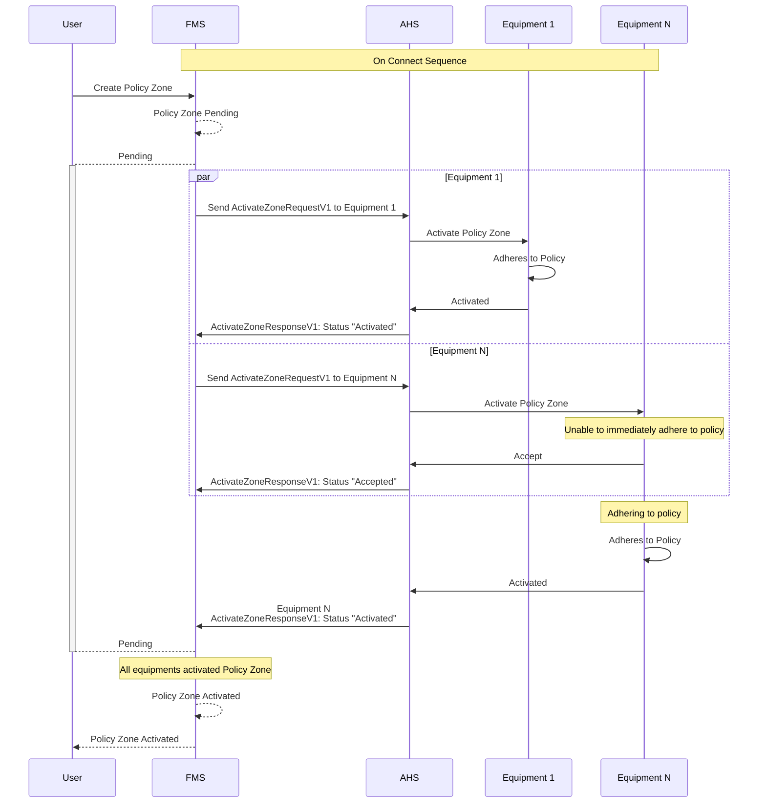

## Policy Zone Activation
When a policy zone is created, it should follow the following sequence to activate the policy zone between AHS and FMS system

```mermaid
sequenceDiagram
    participant User
    participant FMS
    participant AHS
    participant Equipment 1
    participant Equipment N

    Note over FMS,Equipment N: On Connect Sequence
    User->>FMS: Create Policy Zone
    FMS-->>FMS: Policy Zone Pending
    FMS-->+User: Pending
    par Equipment 1
        FMS->>AHS: Send ActivateZoneRequestV1 to Equipment 1
        AHS->>Equipment 1: Activate Policy Zone
        Equipment 1->>Equipment 1: Adheres to Policy
        Equipment 1->>AHS: Activated
        AHS->>FMS: ActivateZoneResponseV1: Status "Activated"
    and Equipment N
        FMS->>AHS: Send ActivateZoneRequestV1 to Equipment N
        AHS->>Equipment N: Activate Policy Zone
        Note Over Equipment N: Unable to immediately adhere to policy
        Equipment N->>AHS: Accept
        AHS->>FMS: ActivateZoneResponseV1: Status "Accepted"
    end 
    Note Over Equipment N: Adhering to policy
    Equipment N->>Equipment N: Adheres to Policy
    Equipment N->>AHS: Activated
    
    AHS->>FMS: Equipment N <br/> ActivateZoneResponseV1: Status "Activated"
    User-->-FMS: Pending
    Note Over FMS: All equipments activated Policy Zone
    FMS-->>FMS: Policy Zone Activated
    FMS-->>User: Policy Zone Activated
```