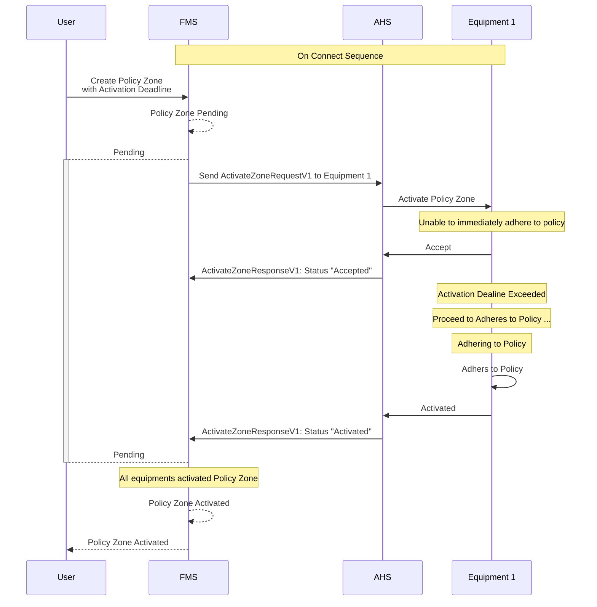

## Policy Zone Activation Deadline Exceed
The policy zone can be created with a `activationDealine` property. This field is an indicative field that lets the equipment know it should start to adhere to the policy if possible. However, it is not a strict demand that the equipment must comply by the specified time.

