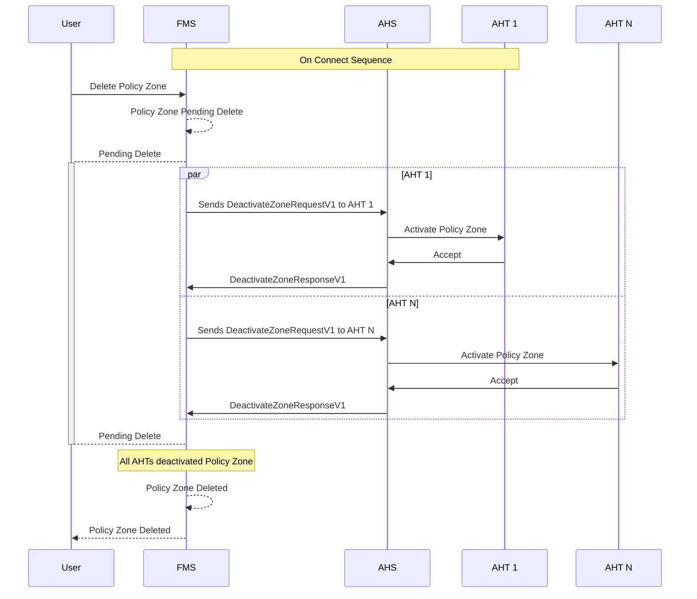

# Policy Zone Deletion
When a policy zone is deleted, the Fleet Management System (FMS) will send a request to the Autonomous Haulage System (AHS) to deactivate the policy zone on all Autonomous Haulage Trucks (AHT) that are currently adhering to it. The AHS will then communicate with each AHT to deactivate the policy zone.

Assuming the policy zone already exist and the AHTs are aware of the policy zone

