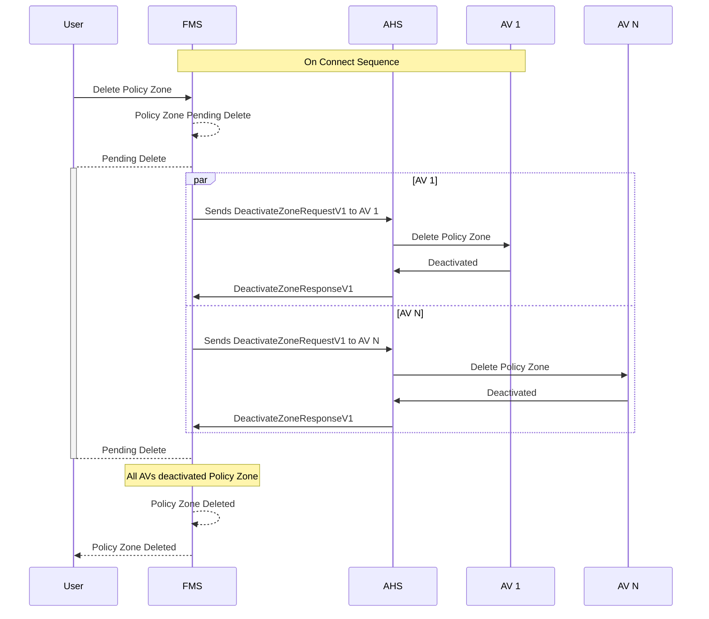

# Policy Zone Deletion
When a policy zone is deleted, the Fleet Management System (FMS) will send a request to the Autonomous Haulage System (AHS) to deactivate the policy zone on all Autonomous Vehicles (AV) that are currently adhering to it. The AHS will then communicate with each AV to deactivate the policy zone.

> [!IMPORTANT]
> - All systems shall implement idempotency when managing Policy Zone Deletions.
> - To avoid unmanagable synchronization failures, AVs should accept Policy Zone Deletions for zones that do not exist in the AVs memory.

Assuming the policy zone already exists in the FMS

