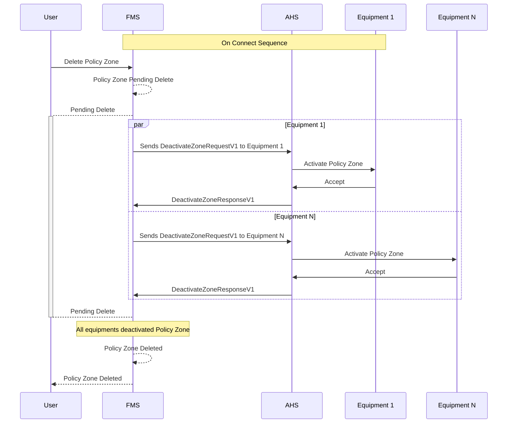

## Policy Zone Delete

Assuming the policy zone already exist and the equipments are aware of the policy zone

```mermaid
sequenceDiagram
    participant User
    participant FMS
    participant AHS
    participant Equipment 1
    participant Equipment N

    Note over FMS,Equipment 1: On Connect Sequence
    User->>FMS: Delete Policy Zone
    FMS-->>FMS: Policy Zone Pending Delete
    FMS-->+User: Pending Delete

    par Equipment 1
        FMS->>AHS: Sends DeactivateZoneRequestV1 to Equipment 1
        AHS->>Equipment 1: Activate Policy Zone
        Equipment 1->>AHS: Accept
        AHS->>FMS: DeactivateZoneResponseV1
    and Equipment N
        FMS->>AHS: Sends DeactivateZoneRequestV1 to Equipment N
        AHS->>Equipment N: Activate Policy Zone
        Equipment N->>AHS: Accept
        AHS->>FMS: DeactivateZoneResponseV1
    end

    User-->-FMS: Pending Delete

    Note Over FMS: All equipments deactivated Policy Zone
    FMS-->>FMS: Policy Zone Deleted
    FMS-->>User: Policy Zone Deleted
```