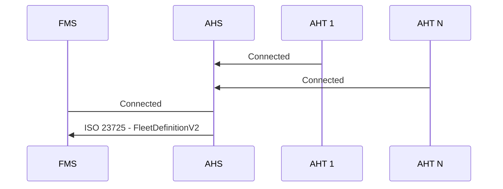

# On Connect
The Autonomous Haulage System (AHS) will send an ISO 23725 `FleetDefinitionV2` message to the Fleet Management System (FMS) of the Autonomous Haulage Trucks(AHT) in the fleet when the connection is established.

