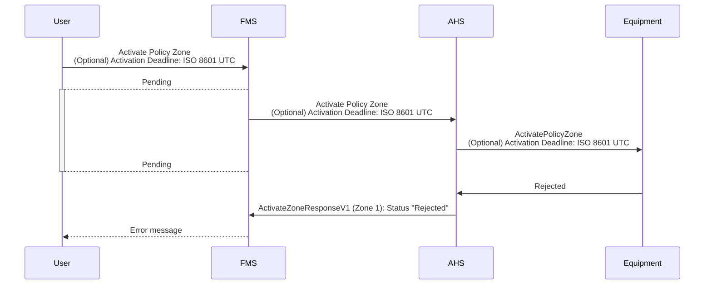
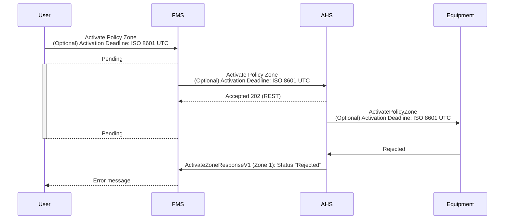

# Sequence Diagram - Policy Zone Rejection

## Message Sequence

```mermaid
sequenceDiagram
    participant User
    participant FMS
    participant AHS
    participant Equipment

    User->>FMS: Activate Policy Zone <br/> (Optional) Activation Deadline: ISO 8601 UTC
    FMS-->+User: Pending
    FMS->>AHS: Activate Policy Zone <br/> (Optional) Activation Deadline: ISO 8601 UTC
    AHS->>Equipment: ActivatePolicyZone <br/> (Optional) Activation Deadline: ISO 8601 UTC
    User-->-FMS: Pending
    Equipment->>AHS: Rejected
    AHS->>FMS: ActivateZoneResponseV1 (Zone 1): Status "Rejected"
    FMS-->>User: Error message
```

## FMS to AHS REST Implementation
(I don't even think we need this...)

```mermaid
sequenceDiagram
    participant User
    participant FMS
    participant AHS
    participant Equipment

    User->>FMS: Activate Policy Zone <br/> (Optional) Activation Deadline: ISO 8601 UTC
    FMS-->+User: Pending
    FMS->>AHS: Activate Policy Zone <br/> (Optional) Activation Deadline: ISO 8601 UTC
    AHS-->>FMS: Accepted 202 (REST)
    AHS->>Equipment: ActivatePolicyZone <br/> (Optional) Activation Deadline: ISO 8601 UTC
    User-->-FMS: Pending
    Equipment->>AHS: Rejected
    AHS->>FMS: ActivateZoneResponseV1 (Zone 1): Status "Rejected"
    FMS-->>User: Error message
```