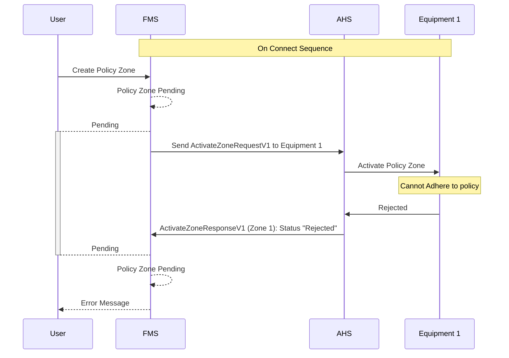

# Policy Zone Activate Rejection
When a equipment cannot adhere to the policy defined in the policy zone definition, AHS should send a `"Rejected"` status in the `ActiveZoneResponse` message to FM. The FMS will then notify the user accordingly.

> [!NOTE]
> If any vehicle rejects the `ActivateZoneRequestV1` message on the same zone, the zone will not be activated within the FMS and will be marked as `"pending"` until the user resolves the issue.

