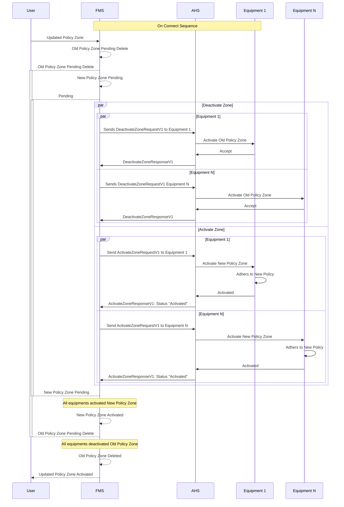

# Policy Zone Update
Given some of the properties of the policy zone are immutable, the FMS will require a deletion on the old policy zone, and create a new policy zone with the new updated information.

Assuming the policy zone already exist and the equipments are aware of the policy zone

