# Policy Zone Update
Given some of the properties of the policy zone are immutable, the Fleet Management System (FMS) will require a deletion on the old policy zone, and create a new policy zone with the new updated information. When a policy zone is updated, the FMS will send requests to the Autonomous Haulage System (AHS) to deactivate the old policy zone and activate the new one on all Autonomous Vehicles (AV). The AHS will then communicate with each AV to internally deactivate the old policy zone and activate the new one.

Assuming the policy zone already exist and the AVs are aware of the policy zone

```mermaid
sequenceDiagram
    participant User
    participant FMS
    participant AHS
    participant AV 1
    participant AV N

    Note over FMS,AV 1: On Connect Sequence
    User->>FMS: Updated Policy Zone
    FMS-->>FMS: Old Policy Zone Pending Delete
    FMS-->+User: Old Policy Zone Pending Delete
    FMS-->>FMS: New Policy Zone Pending
    FMS-->+User: Pending

    par Deactivate Zone
        par AV 1
            FMS->>AHS: Sends DeactivateZoneRequestV1 to AV 1
            AHS->>AV 1: Activate Old Policy Zone
            AV 1->>AHS: Accept
            AHS->>FMS: DeactivateZoneResponseV1
        and AV N
            FMS->>AHS: Sends DeactivateZoneRequestV1 AV N
            AHS->>AV N: Activate Old Policy Zone
            AV N->>AHS: Accept
            AHS->>FMS: DeactivateZoneResponseV1
        end

    and Activate Zone
        par AV 1
            FMS->>AHS: Send ActivateZoneRequestV1 to AV 1
            AHS->>AV 1: Activate New Policy Zone
            AV 1->>AV 1: Adhers to New Policy
            AV 1->>AHS: Activated
            AHS->>FMS: ActivateZoneResponseV1: Status "Activated"
        and AV N
            FMS->>AHS: Send ActivateZoneRequestV1 to AV N
            AHS->>AV N: Activate New Policy Zone
            AV N->>AV N: Adhers to New Policy
            AV N->>AHS: Activated
            AHS->>FMS: ActivateZoneResponseV1: Status "Activated"
        end
    end
    
    User-->-FMS: New Policy Zone Pending
    Note Over FMS: All AVs activated New Policy Zone
    FMS-->>FMS: New Policy Zone Activated

    User-->-FMS: Old Policy Zone Pending Delete
    Note Over FMS: All AVs deactivated Old Policy Zone
    FMS-->>FMS: Old Policy Zone Deleted

    FMS-->>User: Updated Policy Zone Activated
```

