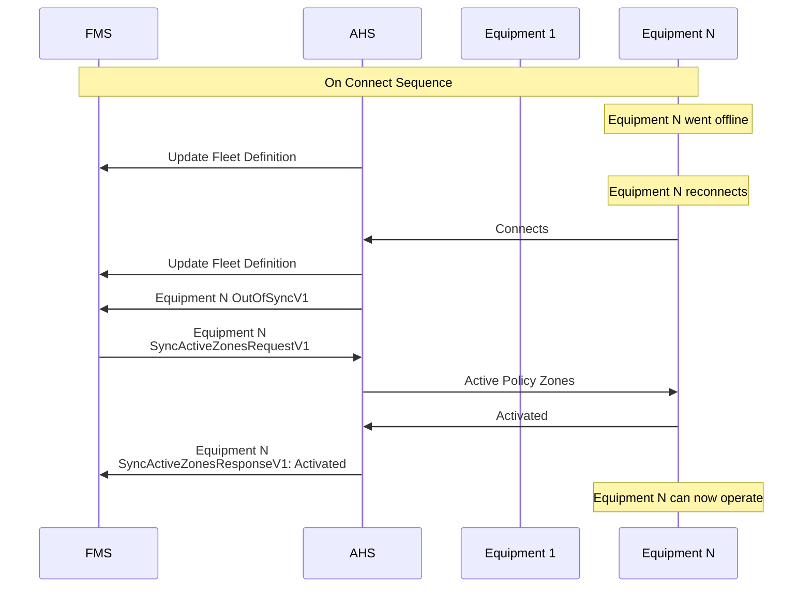
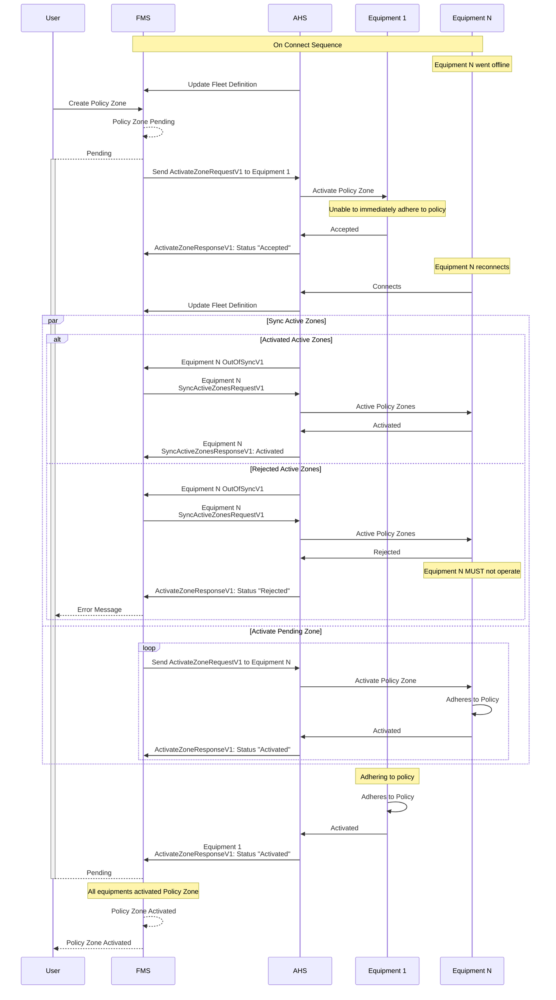

## Resynchronisation

Resynchronisation is required whenever an equipment is switched on, or come back online after having lost communications (it is up to the AHS to determine what consititutes a loss of communication event).

When an equipment comes back online, it should send an `OutOfSyncV1` message to the FMS. This message indicates that the equipment cannot guarantee that it has an up-to-date list of active policy zones, and requires the FMS to send the current set of active zones through a `SyncActiveZonesRequestV1`. While the equipment is out of sync, it must not operate until it has received and internally activated these zones.

There are two scenarios outlined below that 

### Typical Equipment Reconnects

### Equipment Reconnects With New Pending Zone
