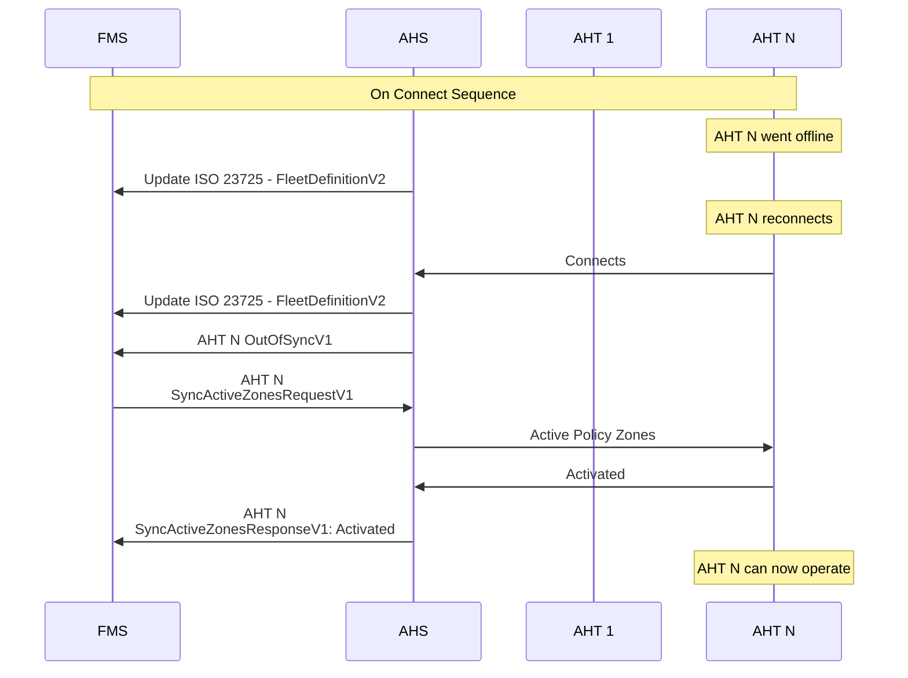
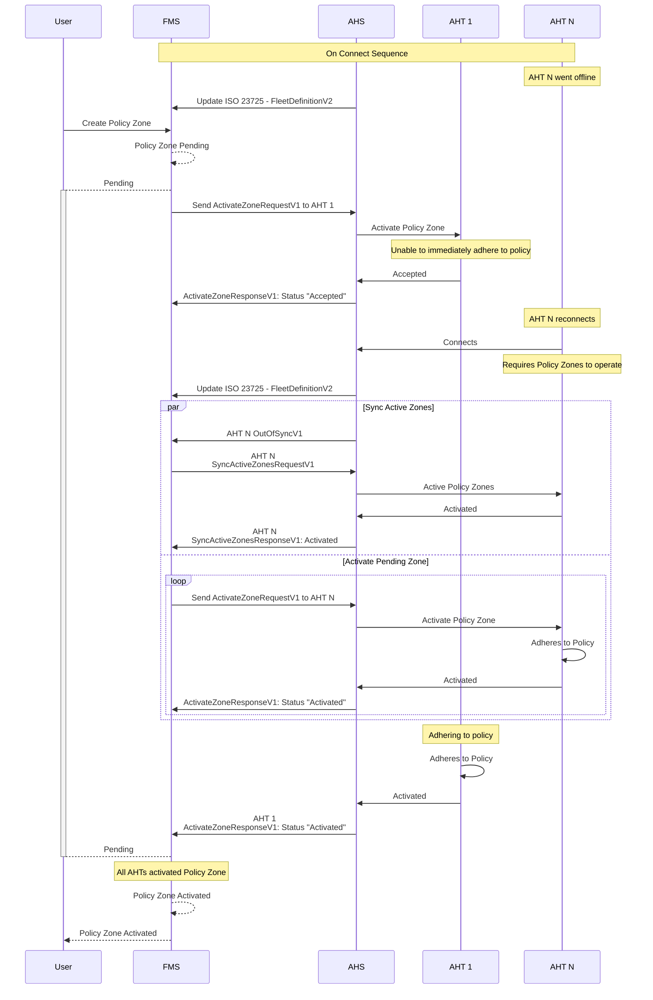
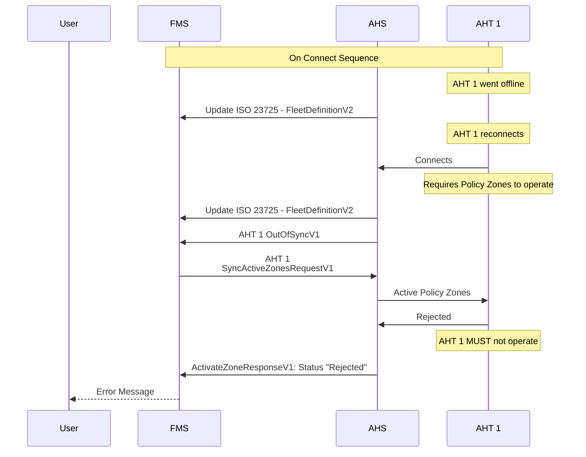

# Resynchronisation

Resynchronisation is required whenever an Autonomous Haulage Truck (AHT) is switched on, or come back online after having lost communications to the Autonomous Haulage System (AHS) (it is up to the AHS to determine what consititutes a loss of communication event).

When an AHT comes back online, it should send an `OutOfSyncV1` message to the Fleet Management System (FMS). This message indicates that the AHT cannot guarantee that it has an up-to-date list of active policy zones, and requires the FMS to send the current set of active zones through a `SyncActiveZonesRequestV1`. While the AHT is out of sync, it must not operate until it has received and internally activated these zones.

## Typical AHT Reconnects


## AHT Reconnects With New Pending Zone
When an AHT reconnects while a new policy zone is pending, the AHT must internally activates all active policy zones sent via `SyncActiveZonesRequestV1` in order to operate. The AHT will also receive an `ActivateZoneRequestV1` message for each of the pending policy zones to be activated internally as well.



## AHT Reconnects - Reject Active Zones
When an AHT reconnects and the active policy zones are internally rejected, it must not operate. The AHS will send a `ActivateZoneResponseV1` with a status of "Rejected", and the FMS shall then notify the user of the error.



## Scenarios

### Expected Offline Scenario

In the event that the truck has been parked up and powered off, the AHS may choose to accept the policy zone change request on behalf of the truck.

The following message provides an example of a policy zone change request that is accepted after the truck has been powered off.

```json
{
    "Protocol": "Open-Autonomy",
    "CorrelationId": "7850cb0e-dee0-4b21-8948-73dec03f3887",
    "Timestamp": "2024-08-23T07:26:33.344Z",
    "ActivateZoneResponseV1": {
        "EquipmentId": "e6d895b0-e377-4567-8b1a-8d2a4f3104ff",
        "ZoneId": "00000000-0000-0000-0000-000000000001",
        "Status": "Accepted"
    }
}
```

* When the truck comes back online the truck shall send OutOfSync to the FMS

```json
{
    "Protocol": "Open-Autonomy",
    "CorrelationId": "7850cb0e-dee0-4b21-8948-73dec03f3887",
    "Timestamp": "2024-08-23T08:19:55.621Z",
    "OutOfSyncV1": {
        "EquipmentId": "e6d895b0-e377-4567-8b1a-8d2a4f3104ff"
    }
}
```

* The FMS should then publish all active zones to the truck using [SyncActiveZonesRequestV1](#specification/V1/SyncActiveZonesRequestV1.md) message which will allow the truck to resynchronize its set of active zones with the FMS.

* Resend any policy zones that are still pending (including the zones that were rejected due to being unexpectedly offline).

### Loss of Comms Scenario 1 - Truck cannot be guaranteed to have come to a stop

In the event that a truck has lost connection to the AHS, the AHS may choose to reject the policy zone change request until the truck has re-established connection.

The following message provides an example of a policy zone change request that is rejected due to the truck being unexpectedly offline.

```json
{
    "Protocol": "Open-Autonomy",
    "CorrelationId": "7850cb0e-dee0-4b21-8948-73dec03f3887",
    "Timestamp": "2024-08-23T07:26:33.344Z",
    "ActivateZoneResponseV1": {
        "EquipmentId": "e6d895b0-e377-4567-8b1a-8d2a4f3104ff",
        "ZoneId": "00000000-0000-0000-0000-000000000001",
        "Status": "Rejected",
        "Reason": "UnexpectedOffline"
    }
}
```

In such an event, the FMS may attempt to continue sending the policy zone change request until the truck has re-established connection.

* When the truck comes back online, the truck shall send OutOfSync to the FMS

```json
{
    "Protocol": "Open-Autonomy",
    "CorrelationId": "7850cb0e-dee0-4b21-8948-73dec03f3887",
    "Timestamp": "2024-08-23T08:19:55.621Z",
    "OutOfSyncV1": {
        "EquipmentId": "e6d895b0-e377-4567-8b1a-8d2a4f3104ff"
    }
}
```
* The FMS should then publish all active zones to the truck using [SyncActiveZonesRequestV1](#specification/V1/SyncActiveZonesRequestV1.md) message which will allow the truck to resynchronize its set of active zones with the FMS.

* Resend any policy zones that are still pending (including the zones that were rejected due to being unexpectedly offline).

### Loss of Comms Scenario 2 - Truck comes to stop after comms loss timeout

In the event that a truck has lost connection to the AHS, the AHS may choose to accept the policy zone change request after the truck can be guaranteed to have come to a stop due to the comms loss timeout.

The following message provides an example of a policy zone change request that is accepted after the truck has come to a stop.

```json
{
    "Protocol": "Open-Autonomy",
    "CorrelationId": "7850cb0e-dee0-4b21-8948-73dec03f3887",
    "Timestamp": "2024-08-23T07:26:33.344Z",
    "ActivateZoneResponseV1": {
        "EquipmentId": "e6d895b0-e377-4567-8b1a-8d2a4f3104ff",
        "ZoneId": "00000000-0000-0000-0000-000000000001",
        "Status": "Accepted"
    }
}
```

* When the truck comes back online the truck shall send OutOfSync to the FMS

```json
{
    "Protocol": "Open-Autonomy",
    "CorrelationId": "7850cb0e-dee0-4b21-8948-73dec03f3887",
    "Timestamp": "2024-08-23T08:19:55.621Z",
    "OutOfSyncV1": {
        "EquipmentId": "e6d895b0-e377-4567-8b1a-8d2a4f3104ff"
    }
}
```

* The FMS should then publish all active zones to the truck using [SyncActiveZonesRequestV1](#specification/V1/SyncActiveZonesRequestV1.md) message which will allow the truck to resynchronize its set of active zones with the FMS.

## Communication Protocols

This specification does not indicate the use of any specific communication protocol between the FMS and AHS. Integrators may therefore choose to support for one or more protocols such as HTTP, WebSockets, or MQTT. 
