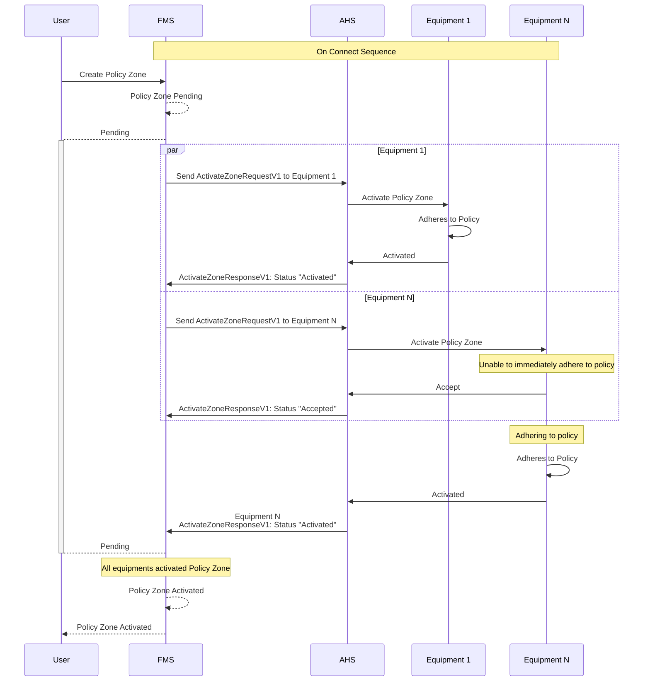
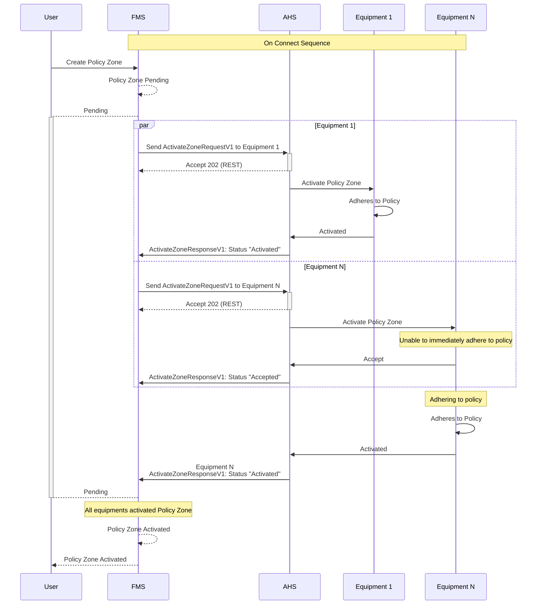
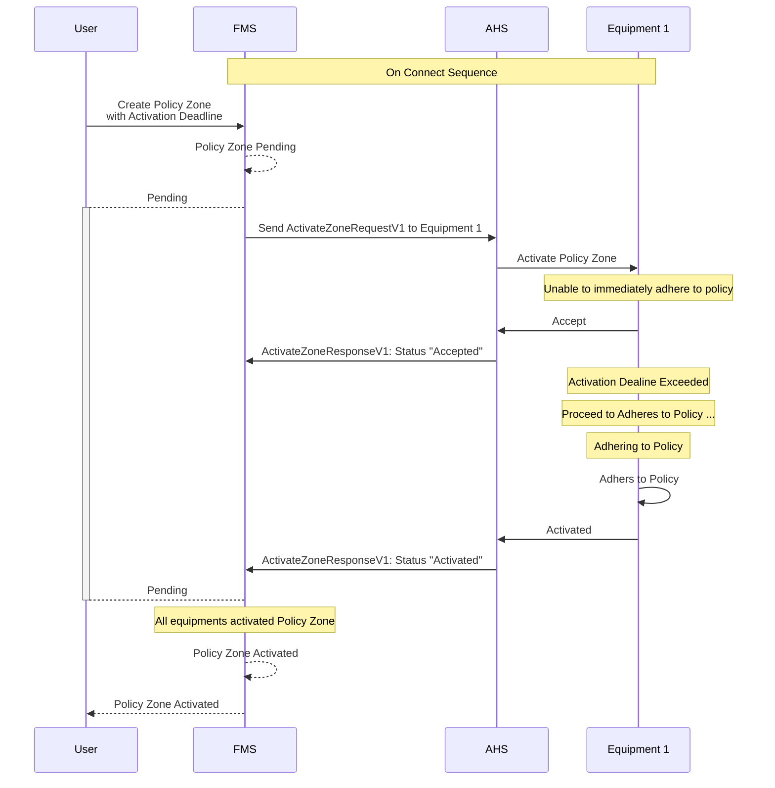
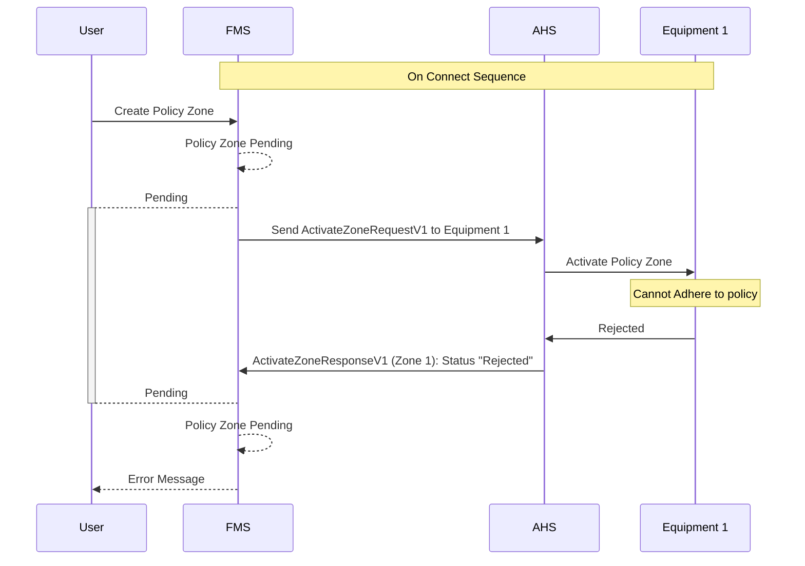
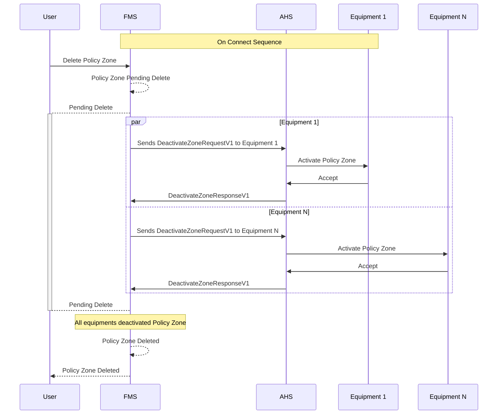
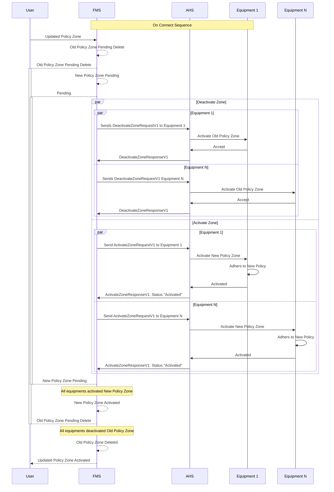

# Policy Zone Sequence Diagrams
The following sections describes when the messages should be sent during the lifecycle of the policy zone messages between the Fleet Management System (FMS) and the Autonomous Haulage System (AHS)

### Language
| Acronyms | Extended Name |
| --- | --- |
| AHS | Autonomouse Haulage System |
| FMS | Fleet Management System |

## Policy Zone Activation
When a policy zone is created, it should follow the following sequence to activate the policy zone between AHS and FMS system

### Policy Zone Activation - With REST Communication From FMS to AHS
The following captures an simple example of REST commnuniation from FMS to AHS.

**Note** This sequence diagram example is to show the implementation if using REST protocol for sending the message. The response from REST is not an indicative of the message being processed and accepted, but that the request is received and accepted by the server.

As shown in the above diagram, the REST response should never should be used as an replacement for the `ActivateZoneResponse` message

## Policy Zone Activation Deadline Exceed
The policy zone can be created with a `activationDealine` property. This field is an indicative field that lets the equipment know it should start to adhere to the policy if possible. However, it is not a strict demand that the equipment must comply by the specified time.

## Policy Zone Rejection

## Policy Zone Delete

Assuming the policy zone already exist and the equipments are aware of the policy zone

## Policy Zone Update
Given some of the properties of the policy zone are immutable, the FMS will require a deletion on the old policy zone, and create a new policy zone with the new updated information.

Assuming the policy zone already exist and the equipments are aware of the policy zone

## Out Of Sync
