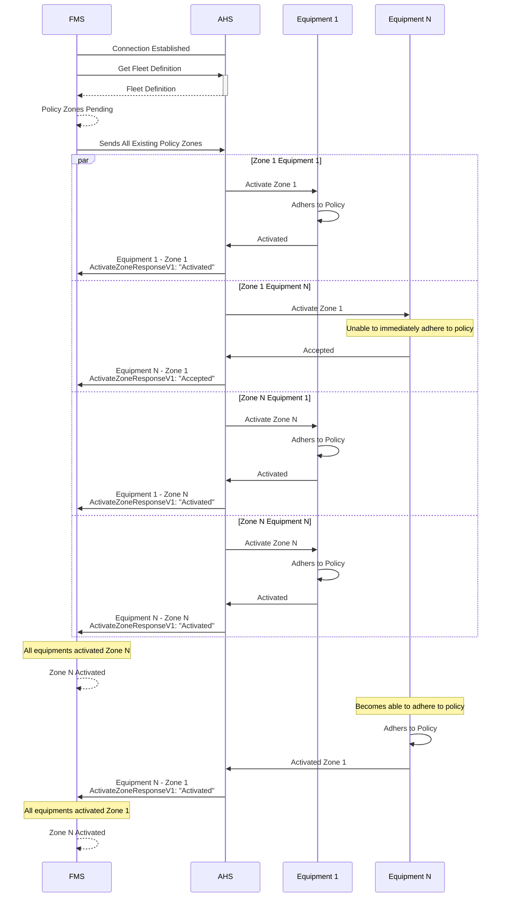
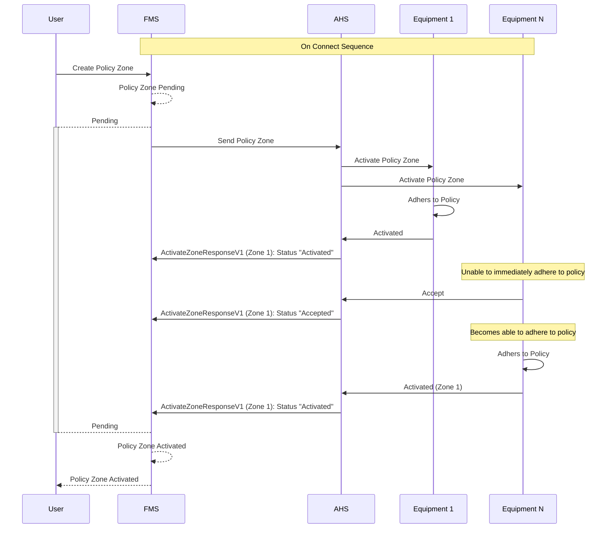
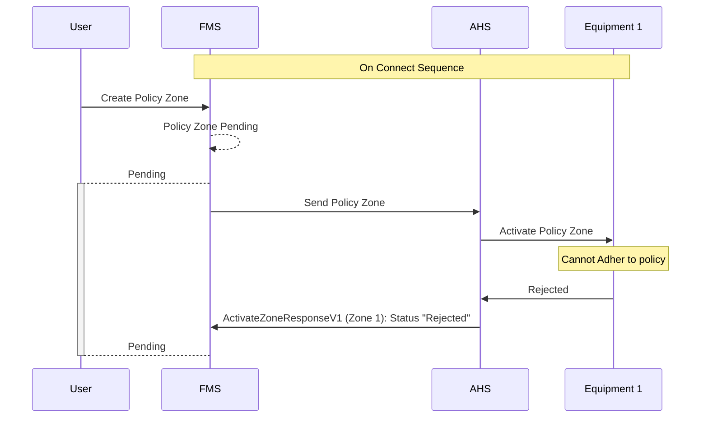

# Policy Zone Sequence Diagrams
The following sections describes when the messages should be sent during the lifecycle of the policy zone messages between the Fleet Management System (FMS) and the Autonomous Haulage System (AHS)

### Language
| Acronyms | Extended Name |
| --- | --- |
| AHS | Autonomouse Haulage System |
| FMS | Fleet Management System |

## On Connect

NOTE: The above diagram is a typical flow of the on connect sequence for policy zone between the FMS and AHS systems.

## Policy Zone Creation and Activation

## Policy Zone Rejection
