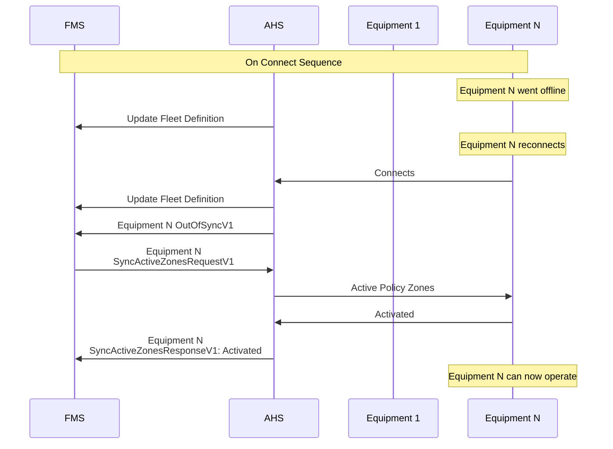
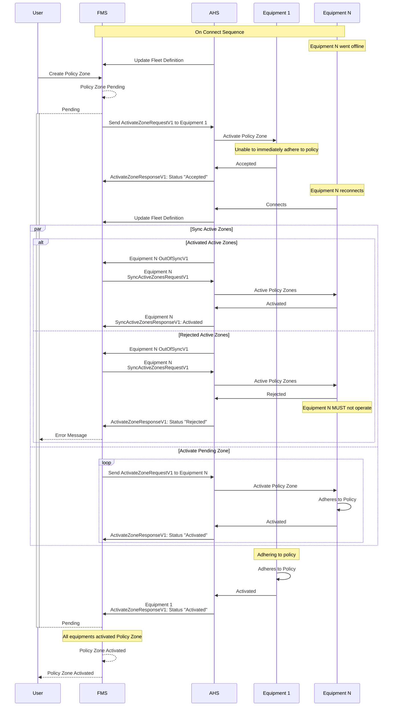

# Policy Zone Sequence Diagrams
The following document describes when the messages should be sent during the lifecycle of the policy zone messages between the Fleet Management System (FMS) and the Autonomous Haulage System (AHS)


## Policy Zone Rejection


## Out Of Sync

Out of sync typically happens when equipment went offline, either it is out of communication, or equipment was down. When the equipment reconnects, there should be an OutOfSyncV1 message sent from AHS to FMS for the equipment.

### Typical Equipment Reconnects


### Equipment Reconnects With New Pending Zone

It is always the responsibility of the AHS to determine whether a policy zone is safe to activate, as it is expected that trucks will go offline from time to time. In the event that a truck is offline when a policy zone change is requested, the AHS may choose to:

 - reject the policy zone change request until the truck has re-established connection.
 - accept the policy zone change request if and only if the truck can be guaranteed to have come to a stop and is no longer in motion.

## Scenarios

### Expected Offline Scenario

In the event that the truck has been parked up and powered off, the AHS may choose to accept the policy zone change request on behalf of the truck.

The following message provides an example of a policy zone change request that is accepted after the truck has been powered off.

```json
{
    "Protocol": "Open-Autonomy",
    "CorrelationId": "7850cb0e-dee0-4b21-8948-73dec03f3887",
    "Timestamp": "2024-08-23T07:26:33.344Z",
    "ActivateZoneResponseV1": {
        "EquipmentId": "e6d895b0-e377-4567-8b1a-8d2a4f3104ff",
        "ZoneId": "00000000-0000-0000-0000-000000000001",
        "Status": "Accepted"
    }
}
```

* When the truck comes back online the truck shall send OutOfSync to the FMS

```json
{
    "Protocol": "Open-Autonomy",
    "CorrelationId": "7850cb0e-dee0-4b21-8948-73dec03f3887",
    "Timestamp": "2024-08-23T08:19:55.621Z",
    "OutOfSyncV1": {
        "EquipmentId": "e6d895b0-e377-4567-8b1a-8d2a4f3104ff"
    }
}
```

* The FMS should then publish all active zones to the truck using [SyncActiveZonesRequestV1](#specification/V1/SyncActiveZonesRequestV1.md) message which will allow the truck to resynchronize its set of active zones with the FMS.

* Resend any policy zones that are still pending (including the zones that were rejected due to being unexpectedly offline).

### Loss of Comms Scenario 1 - Truck cannot be guaranteed to have come to a stop

In the event that a truck has lost connection to the AHS, the AHS may choose to reject the policy zone change request until the truck has re-established connection.

The following message provides an example of a policy zone change request that is rejected due to the truck being unexpectedly offline.

```json
{
    "Protocol": "Open-Autonomy",
    "CorrelationId": "7850cb0e-dee0-4b21-8948-73dec03f3887",
    "Timestamp": "2024-08-23T07:26:33.344Z",
    "ActivateZoneResponseV1": {
        "EquipmentId": "e6d895b0-e377-4567-8b1a-8d2a4f3104ff",
        "ZoneId": "00000000-0000-0000-0000-000000000001",
        "Status": "Rejected",
        "Reason": "UnexpectedOffline"
    }
}
```

In such an event, the FMS may attempt to continue sending the policy zone change request until the truck has re-established connection.

* When the truck comes back online, the truck shall send OutOfSync to the FMS

```json
{
    "Protocol": "Open-Autonomy",
    "CorrelationId": "7850cb0e-dee0-4b21-8948-73dec03f3887",
    "Timestamp": "2024-08-23T08:19:55.621Z",
    "OutOfSyncV1": {
        "EquipmentId": "e6d895b0-e377-4567-8b1a-8d2a4f3104ff"
    }
}
```
* The FMS should then publish all active zones to the truck using [SyncActiveZonesRequestV1](#specification/V1/SyncActiveZonesRequestV1.md) message which will allow the truck to resynchronize its set of active zones with the FMS.

* Resend any policy zones that are still pending (including the zones that were rejected due to being unexpectedly offline).

### Loss of Comms Scenario 2 - Truck comes to stop after comms loss timeout

In the event that a truck has lost connection to the AHS, the AHS may choose to accept the policy zone change request after the truck can be guaranteed to have come to a stop due to the comms loss timeout.

The following message provides an example of a policy zone change request that is accepted after the truck has come to a stop.

```json
{
    "Protocol": "Open-Autonomy",
    "CorrelationId": "7850cb0e-dee0-4b21-8948-73dec03f3887",
    "Timestamp": "2024-08-23T07:26:33.344Z",
    "ActivateZoneResponseV1": {
        "EquipmentId": "e6d895b0-e377-4567-8b1a-8d2a4f3104ff",
        "ZoneId": "00000000-0000-0000-0000-000000000001",
        "Status": "Accepted"
    }
}
```

* When the truck comes back online the truck shall send OutOfSync to the FMS

```json
{
    "Protocol": "Open-Autonomy",
    "CorrelationId": "7850cb0e-dee0-4b21-8948-73dec03f3887",
    "Timestamp": "2024-08-23T08:19:55.621Z",
    "OutOfSyncV1": {
        "EquipmentId": "e6d895b0-e377-4567-8b1a-8d2a4f3104ff"
    }
}
```

* The FMS should then publish all active zones to the truck using [SyncActiveZonesRequestV1](#specification/V1/SyncActiveZonesRequestV1.md) message which will allow the truck to resynchronize its set of active zones with the FMS.

## Communication Protocols

This specification does not indicate the use of any specific communication protocol between the FMS and AHS. Integrators may therefore choose to support for one or more protocols such as HTTP, WebSockets, or MQTT. 
